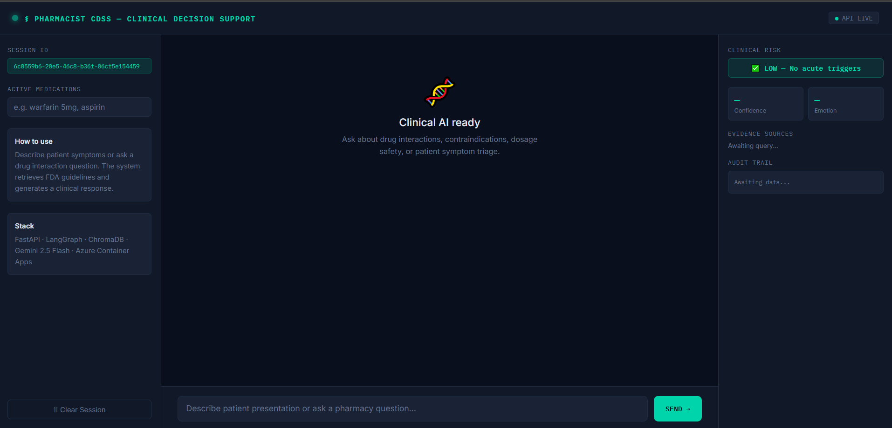
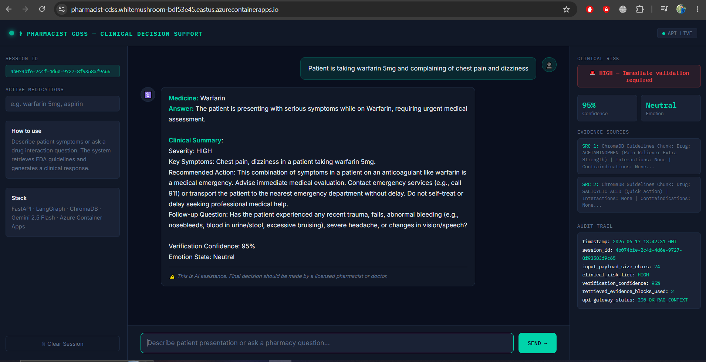
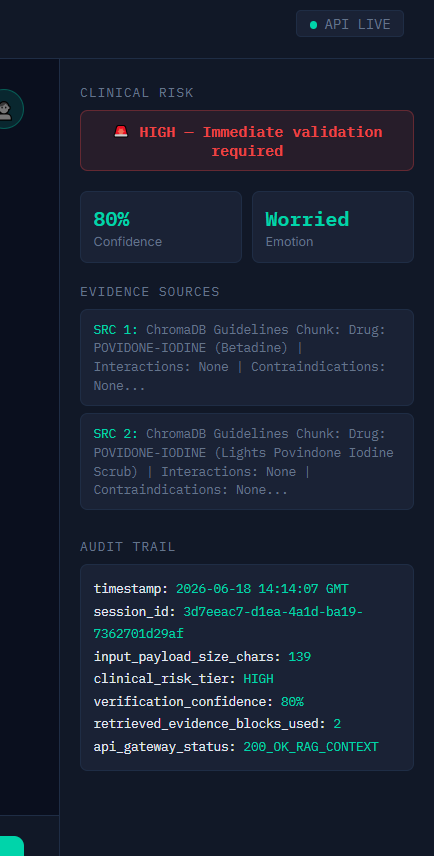
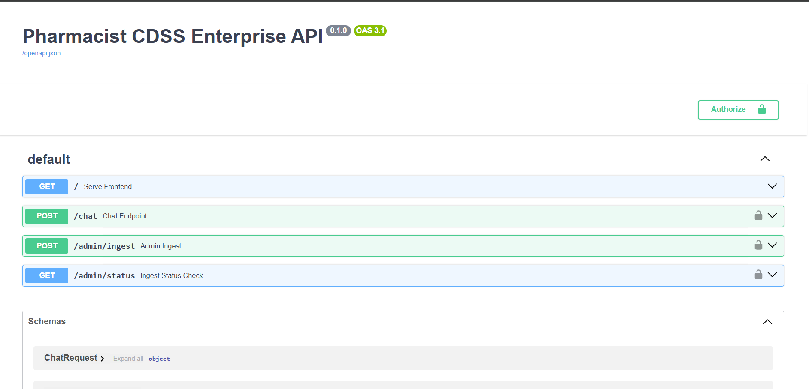
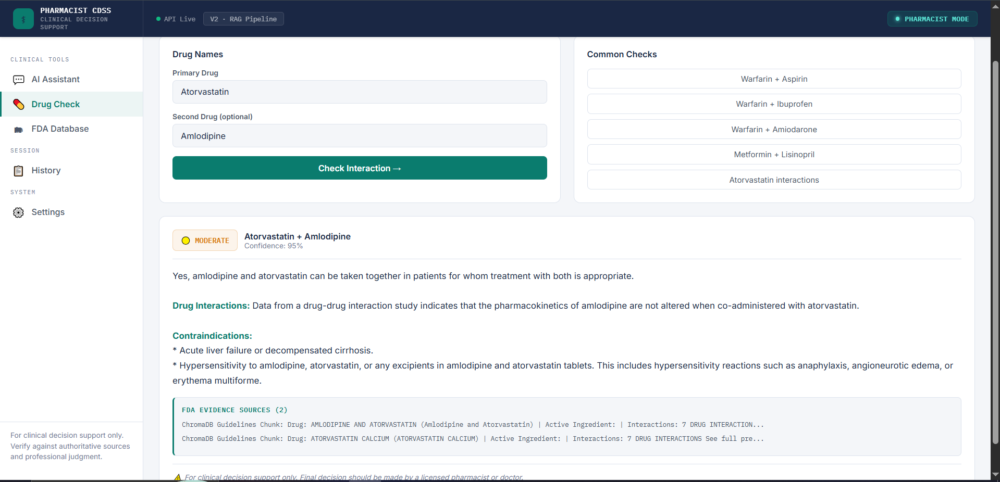
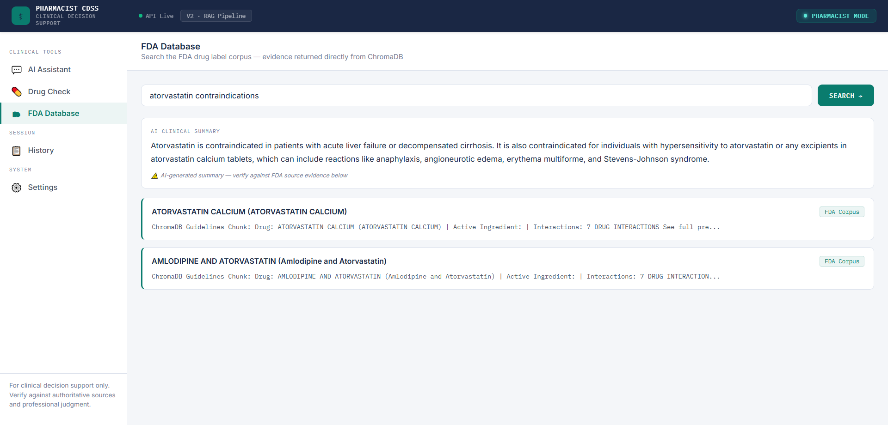

# Pharmacist CDSS — AI-Powered Clinical Decision Support System

A production-grade Clinical Decision Support System that assists pharmacists and healthcare professionals with drug interaction checks, medication safety assessment, and evidence-grounded clinical guidance.

The system exists in two versions:
- **V2 (RAG Pipeline)** — LangGraph 3-node pipeline with ChromaDB, local embeddings, CrossEncoder reranking, query rewriting, and structured JSON output
- **V3 (Agentic)** — LangGraph agent where Gemini decides when to call the FDA tool, with conditional routing and 100% tool routing accuracy

Both versions retrieve real FDA drug records (806 labels) and generate structured clinical responses with risk assessment, emotion detection, and full audit logging.

---

## Key Features

### Clinical Decision Support
* Drug interaction safety checks
* Medication side effect guidance
* Patient symptom triage with severity scoring (LOW/MODERATE/HIGH)
* Structured clinical responses with evidence grounding
* Out-of-scope query rejection — non-clinical queries refused automatically

### Retrieval-Augmented Generation (RAG) — V2
* Local all-MiniLM-L6-v2 embeddings — free, unlimited, no API quota
* ChromaDB vector database with 806 FDA drug labels
* CrossEncoder reranking (ms-marco-MiniLM-L-6-v2) for precision
* Query rewriting — extracts drug names + clinical intent keywords
* Cosine similarity threshold — rejects irrelevant chunks
* Evidence-grounded responses with source attribution

### Agentic Tool Calling — V3
* LangGraph agent loop — Gemini decides when FDA tool is needed
* `check_fda_database()` tool — query rewriting + ChromaDB + CrossEncoder
* Conditional routing — clinical queries → FDA tool, out-of-scope → direct refusal
* 100% tool routing accuracy across 20 evaluation queries
* 90% grounded responses — answers backed by retrieved FDA evidence

### Evaluation Framework
* V2: 24-query eval — 100% direct lookup, 83% interaction, 100% contraindication
* V3: 20-query agent eval — 100% tool routing, 90% grounded responses
* Separate retrieval and agent evaluation scripts

### Production Infrastructure
* FastAPI backend with API key security and input validation
* Docker containerized deployment
* Azure Container Apps cloud hosting
* GitHub Actions CI/CD pipeline
* Custom HTML/JS frontend served from same container
* Full audit trail per query — retrieval distance, latency, confidence score

## 📸 System in Action

**Clinical AI Interface — Ready State**


**Drug Interaction Query — HIGH Risk Triggered**


**Patient Symptom Triage — Clinical Summary Generated**


**Live Telemetry — RAG Evidence Sources + Audit Trail**


**API Documentation — Swagger UI**


**Drug Interaction Check — FDA Evidence Retrieved**


**FDA Evidence Search — Direct ChromaDB Retrieval**


## Problem Statement

Pharmacists in high-volume settings make 50+ drug interaction checks daily under time pressure. Errors in drug interaction assessment contribute to 1.5 million patient injuries annually in the US. Existing tools are either too slow, too generic, or not grounded in verified FDA data.

This system provides instant, FDA-verified drug interaction guidance with explicit risk flagging, evidence attribution, and full audit logging — designed as a decision support tool, not a replacement for clinical judgment.

## Project Goal

To demonstrate how modern AI engineering combines RAG pipelines, agentic tool calling, vector databases, LLM reasoning, and cloud infrastructure to build a deployable, production-ready clinical decision support application.

This project focuses on **practical AI system building** — not standalone model training — showing how multiple AI components can be orchestrated into a real deployed product across two progressively advanced architectures:

- **V2** — Production RAG pipeline with evaluation, observability, and safety controls
- **V3** — Agentic system where the LLM decides when and how to use the FDA retrieval tool

---

## 🚀 Current Implementation

The system exists in two production-ready versions. All components are built, evaluated, and pushed to GitHub.

### V2 — RAG Pipeline (main_demo.py)

**FastAPI API Gateway**
* Asynchronous API endpoints
* Pydantic request validation with Optional typing
* API key security middleware
* Input sanitization — empty/oversized messages rejected
* RESTful architecture with Swagger docs

**LangGraph 3-Node Pipeline**
* Triage Node — clinical keyword detection, drug name extraction, query rewriting
* Generation Node — FDA context injection, Gemini JSON output, grounding instruction
* Telemetry Node — JSON parsing with regex fallback, risk level, confidence, emotion

**Retrieval-Augmented Generation**
* ChromaDB vector storage (806 FDA drug labels)
* Local all-MiniLM-L6-v2 embeddings — free, unlimited
* CrossEncoder reranking — ms-marco-MiniLM-L-6-v2
* Cosine similarity threshold (0.95) — rejects irrelevant chunks
* Query rewriting — drug names + clinical intent keywords
* openFDA API auto-ingestion on startup with duplicate removal

**Observability**
* Retrieval distance logged per query
* Latency tracked per request
* Full audit trail — session, risk tier, confidence, evidence blocks used

### V3 — Agentic Pipeline (main_agentic.py)

**LangGraph Agent Loop**
* Agent node — Gemini decides whether FDA tool is needed
* Tool node — executes check_fda_database()
* Conditional routing — clinical → tool, out-of-scope → direct refusal
* MemorySaver for session continuity

**FDA Tool (check_fda_database)**
* Query rewriting — extracts drug names + clinical intent
* ChromaDB retrieval — top 5 candidates
* CrossEncoder reranking — scores and sorts by relevance
* Returns ranked evidence with reranker scores and vector distances

**Evaluation Framework**
* V2: 24-query eval — direct lookup 100%, interaction 83%, contraindication 100%
* V3: 20-query agent eval — tool routing 100%, grounded responses 90%
* Separate evaluation scripts in /evaluation directory

**Frontend UI**
* Custom HTML/CSS/JS chat interface
* Live telemetry panel (risk, confidence, emotion)
* Real-time audit trail display
* Served directly from FastAPI

**Containerization & Deployment**
* Dockerized with Azure Container Registry
* Azure Container Apps hosting
* GitHub Actions CI/CD pipeline
* Auto-deploy on every git push
---
## 🏗️ System Architecture

### V2 — RAG Pipeline

```text
User Query (Frontend UI)
        │
        ▼
FastAPI API Gateway
(API Key Security + Pydantic Validation + Input Sanitization)
        │
        ▼
LangGraph 3-Node Pipeline
        │
        ▼
Triage Node
(Query Rewriting + Drug Extraction + Keyword Detection)
        │
        ▼
ChromaDB Vector Search
(806 FDA Records + Local Embeddings + Cosine Threshold)
        │
        ▼
CrossEncoder Reranking
(ms-marco-MiniLM-L-6-v2)
        │
        ▼
Generation Node
(Gemini 2.5 Flash + FDA Context Injection + JSON Output)
        │
        ▼
Telemetry Node
(JSON Parsing + Risk Level + Confidence + Emotion)
        │
        ▼
Structured Clinical Response + Full Audit Trail
(retrieval_distance + latency_ms + evidence_sources)
```

### V3 — Agentic Pipeline

```text
User Query
        │
        ▼
FastAPI API Gateway
(API Key Security + Pydantic Validation)
        │
        ▼
LangGraph Agent Node
(Gemini decides: does this need FDA evidence?)
        │
   ┌────┴────────────────┐
   ▼                     ▼
Clinical Query      Out-of-Scope Query
   │                     │
   ▼                     ▼
check_fda_database()  Direct Refusal
(Query Rewriting +    (No tool called)
ChromaDB + CrossEncoder)
   │
   ▼
FDA Evidence
   │
   ▼
Agent Node
(Gemini synthesizes grounded clinical response)
        │
        ▼
Response + tool_called + fda_evidence_used + risk_level + latency
```
---
## 📁 Project Structure

```text
app/
│
├── main_demo.py          # V2 — FastAPI + LangGraph RAG pipeline
├── main_agentic.py       # V3 — FastAPI + LangGraph agentic pipeline
├── main_demo_backup.py   # V2 backup before Phase 6 changes
│
└── utils/
    └── logger.py         # Structured logging

evaluation/
├── test_cases.json       # 20 agent evaluation queries
├── evaluate_agent.py     # V3 agent evaluation script
└── results.json          # Latest evaluation results

static/
└── index.html            # Frontend UI (V2)

screenshots/              # Testing proof screenshots

.github/
└── workflows/
    └── deploy.yml        # GitHub Actions CI/CD

Dockerfile                # Container build
requirements.txt          # Python dependencies
eval.py                   # V2 RAG evaluation script (24 queries)
README.md
```


---

## 🧠 AI Workflow

### V2 — RAG Pipeline (main_demo.py)
1. Pharmacist submits query via frontend UI
2. FastAPI validates and routes the request
3. **Triage Node** — detects clinical keywords, rewrites query with drug names + intent keywords
4. **RAG Node** — ChromaDB semantic search retrieves top 5 FDA chunks, CrossEncoder reranks them
5. **Generation Node** — Gemini 2.5 Flash receives retrieved FDA context + generates structured JSON response
6. **Telemetry Node** — parses JSON, extracts risk level, confidence score, emotion state
7. Structured clinical response returned with full audit trail including retrieval distance and latency

### V3 — Agentic Pipeline (main_agentic.py)
1. Pharmacist submits query via FastAPI
2. **Agent Node** — Gemini decides: does this query need FDA evidence?
3. If YES → calls `check_fda_database()` tool → query rewriting → ChromaDB → CrossEncoder reranking
4. FDA evidence injected back into agent context
5. **Agent Node** — Gemini synthesizes clinical response grounded in FDA evidence
6. If NO (out-of-scope) → agent refuses directly without calling tool
7. Response returned with tool_called flag, grounding status, risk level, latency

---
## 🔄 Knowledge Ingestion Pipeline
```text
openFDA API (806 FDA drug labels)
│
▼
Auto-ingest on Startup (BackgroundTasks)
│
▼
Text Chunking (drug + interactions + contraindications + side effects + warnings + dosage)
│
▼
Duplicate removal (seen_documents set)
│
▼
Local all-MiniLM-L6-v2 Embeddings (free, unlimited, no API quota)
│
▼
ChromaDB Vector Store (PersistentClient)
│
▼
Query Rewriting + CrossEncoder Reranking
│
▼
RAG or Agentic Retrieval Layer
```

---

## ☁️ Production Infrastructure

| Component | Technology |
|---|---|
| Backend API | FastAPI + Uvicorn |
| AI Orchestration | LangGraph 3-node pipeline |
| Vector Database | ChromaDB + Gemini Embeddings |
| LLM | Gemini 2.5 Flash |
| Containerization | Docker |
| Cloud Hosting | Azure Container Apps |
| CI/CD | GitHub Actions |
| Frontend | Custom HTML/JS served via FastAPI |
| Security | API Key middleware |
| Monitoring | Structured audit logging |

---
---

## 📦 Technologies Used

| Category | Technology |
|---|---|
| Language | Python 3.11 |
| API Framework | FastAPI + Uvicorn |
| AI Orchestration | LangGraph (RAG pipeline + Agentic loop) |
| LLM | Gemini 2.5 Flash (google-genai SDK) |
| Embeddings | Local all-MiniLM-L6-v2 (sentence-transformers) |
| Reranker | CrossEncoder ms-marco-MiniLM-L-6-v2 |
| Vector Database | ChromaDB PersistentClient |
| Data Validation | Pydantic v2 |
| Containerization | Docker |
| Cloud Platform | Azure Container Apps |
| Container Registry | Azure Container Registry |
| CI/CD | GitHub Actions |
| Data Source | openFDA API (806 FDA drug labels) |
| Frontend | HTML + CSS + JavaScript |
| Evaluation | Custom eval framework (retrieval + agent grounding metrics) |

---

## 🎯 What This Project Demonstrates

| AI Engineering Concept | Implementation |
|---|---|
| LLM Integration | Gemini 2.5 Flash via google-genai SDK |
| Retrieval-Augmented Generation | ChromaDB + Local Embeddings + openFDA API (806 FDA records) |
| Agentic AI | LangGraph agent with conditional FDA tool calling (V3) |
| AI Orchestration | LangGraph 3-node pipeline (V2) + Agent loop (V3) |
| Vector Database | ChromaDB PersistentClient |
| Semantic Search | Local all-MiniLM-L6-v2 sentence-transformers |
| Reranking | CrossEncoder ms-marco-MiniLM-L-6-v2 |
| Query Rewriting | Drug name extraction + clinical intent keywords |
| Structured Output | Gemini JSON output + Pydantic validation |
| Evaluation | 24-query RAG eval + 20-query agent eval with grounding metrics |
| API Engineering | FastAPI + Pydantic validation + input sanitization |
| Containerization | Docker + Azure Container Registry |
| CI/CD | GitHub Actions automated deployment |
| Cloud Deployment | Azure Container Apps |
| MLOps | Auto-ingestion on startup + audit logging + retrieval distance tracking |
| Security | API Key middleware + secret management |
| Frontend Integration | Custom HTML/JS served from FastAPI |

## Performance Metrics

| Metric | V1 (Baseline) | V2 (RAG Pipeline) | V3 (Agentic) |
|---|---|---|---|
| Direct Lookup Accuracy | 80% (4/5) | 100% (7/7) | 100% |
| Drug Interaction Accuracy | 100% (4/4) | 83% (5/6) | 80% (4/5) |
| Contraindication Accuracy | 100% (4/4) | 100% (6/6) | 100% (3/3) |
| Out-of-Scope Rejection | Not tested | 100% (3/3) | 100% (4/4) |
| Tool Routing Accuracy | N/A | N/A | 100% (20/20) |
| Grounded Responses | N/A | N/A | 90% (18/20) |
| Records in ChromaDB | 19 FDA labels | 444 FDA labels | 806 FDA labels |
| Embedding Model | Gemini cloud API | Local all-MiniLM-L6-v2 | Local all-MiniLM-L6-v2 |
| Reranker | None | CrossEncoder | CrossEncoder |
| Similarity Threshold | None | 0.95 cosine distance | 0.95 cosine distance |
| Eval Test Cases | 10 queries | 24 queries | 20 queries |
| p95 Latency | ~16s (cold start) | ~5-8s (local) | ~5-10s (local) |
| Cost per Request | ~$0.0008 | ~$0.0004 | ~$0.0004 |

## V3 Agentic Key Findings
- Gemini correctly routes ALL 20 queries — tool called for clinical, refused for out-of-scope
- 90% of clinical responses grounded in retrieved FDA evidence
- 2 misses: ibuprofen data quality gap + ambiguous query without drug context

## Known Limitations
* Multi-drug interaction queries occasionally favor one drug's chunk over the other
* Ibuprofen FDA records in corpus have incomplete interaction data
* Gemini free tier limits evaluation to 20 requests/day

## 🔧 Engineering Challenges & Solutions

| Problem | Root Cause | Fix |
|---|---|---|
| Container OOM crash | ChromaDB + ONNX loading 3GB+ RAM on startup | Switched to cloud Gemini embeddings, removed local ONNX runtime entirely |
| 503 timeout on ingest | 130MB ZIP upload exhausting Azure proxy timeout | Replaced file upload with direct openFDA API + FastAPI BackgroundTasks |
| GeminiEmbeddingFunction not found | ChromaDB 0.5.3 naming convention change | Wrote custom `GeminiEmbeddingFunction(EmbeddingFunction)` class using google-genai SDK |
| Static files missing in container | Dockerfile missing `COPY ./static` line | Added `COPY ./static /code/static` to Dockerfile |
| Git push conflicts | CI/CD auto-commits diverging from local branch | Used `git pull --rebase` + force push to resolve |
| Hardcoded API key fallback in auth logic | `os.getenv("CDSS_API_KEY", "prod-secret-fallback-key")` — silent fallback to a public, committed string if env var unset | Removed fallback; auth now fails loudly at startup via `RuntimeError` if `CDSS_API_KEY` is missing |
| Eval script reported false 100% accuracy | Hit detection checked only HTTP gateway status, never verified the correct drug was actually retrieved | Rewrote eval to check expected drug term presence in retrieved evidence, added 5-category breakdown (direct lookup, interaction, contraindication, ambiguous, out-of-scope) |
| Ingested drugs didn't match tested drugs | openFDA ingestion pulled a random top-50 batch with no guarantee target drugs (warfarin, aspirin, etc.) were included | Added explicit per-drug openFDA fetch before the general batch, guaranteeing core test drugs are always in the corpus |
| Corrupted API key at runtime | Manual shell `export` left a stale, multi-line-corrupted value in the terminal session; `load_dotenv()` doesn't override existing env vars by default | Switched to `load_dotenv(override=True)` so `.env` always takes priority over stray shell state |
| Windows local dev blocked by native build | `chroma-hnswlib==0.7.3` (via `chromadb==0.5.3`) has no prebuilt Windows wheel for Python 3.12, requires MSVC compiler | Upgraded to `chromadb==0.5.4` (prebuilt wheel available), decoupled `langchain-chroma` install with `--no-deps` to resolve a metadata-only version conflict |
| Out-of-scope queries returning irrelevant chunks | No similarity threshold — ChromaDB always returned nearest neighbor even for unrelated queries | Added cosine distance threshold (0.8) in triage node — rejects chunks above threshold, returns 'No relevant FDA evidence found' |
| Gemini daily quota exhausted during eval | Free tier allows only 20 generation requests/day — eval script sent all queries too fast | Added `time.sleep(20)` between eval requests to stay within rate limits |
| ChromaDB collection lost between server restarts | `run_ingest()` deletes and recreates collection — agentic server held stale reference | Switched from `get_collection()` to `get_or_create_collection()` + fresh collection reference inside `check_fda_database()` |
| Gemini returning JSON wrapped in markdown backticks | Gemini occasionally wraps JSON in ` ```json ``` ` despite prompt instructions | Added `except Exception` catch in telemetry node — falls back to regex parsing when JSON parsing fails |
| Local embedding quota hit during large ingest | Gemini free tier embedding API has 1000 requests/day limit — 200+ records exhausted it | Switched to local `all-MiniLM-L6-v2` sentence-transformers model — free, unlimited, no API calls |
| Pydantic validation crash on null warnings field | `warnings: str = None` not valid in Pydantic v2 — `None` is not a string | Changed to `warnings: Optional[str] = None` with proper `Optional` typing |


### 🔬 Research & Development

The exploratory data analysis, severity classification modeling, and initial workflow prototyping for this clinical support tool were developed in Google Colab. You can view and run the experimental notebook directly via the link below:

* [Launch Active Colab Notebook](https://colab.research.google.com/drive/1KwWJRlIynOMbfM8f3zcUym4lCNytyoj8#scrollTo=MUOtHKZA2L7n)
